Answers below or refer to JohnnyWuSEDatadog2.pdf

Author: Johnny Wu
Position: Sales Engineer Datadog

ABSTRACT:
Dear readers, 

Thank you so much for a wonderful opportunity to practice creating meaningful dashboard metrics that would help clients observe their systems better. I look forward to expanding my implementation knowledge and leverage my previous technical and communication skills to help clients enhance the Datadog dashboard features.

Best,
Johnny 
COLLECTING METRICS:
Tasks:
-	Add tags in the Agent config file and show us a screenshot of your host and its tags on the Host Map page in Datadog 
-	 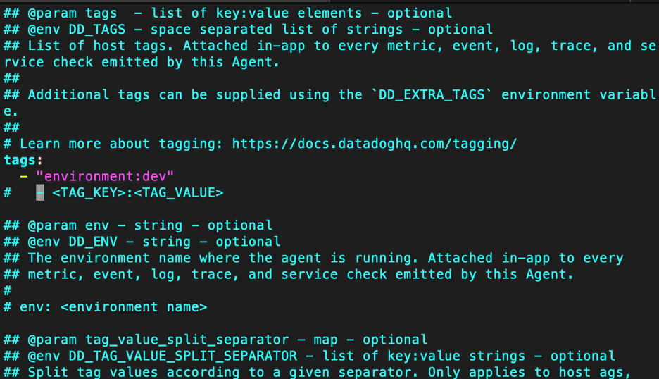
-    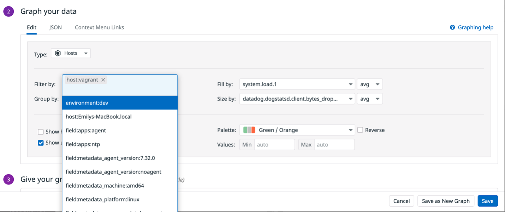
-	Create a custom Agent check that submits a metric with a random value between 0 and 1000 
-    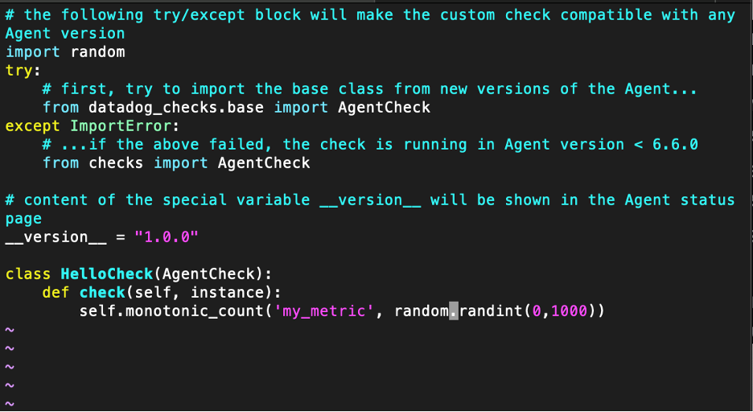
-	Change your check’s collection interval so that it only submits the metric once every 45 seconds 
-    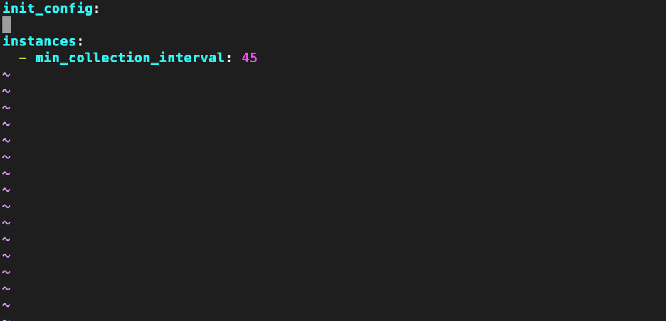
BONUS QUESTION: Can you change the collection interval without modifying the Python check file you created?
ANSWER: yes, you can change the collection interval without modifying the Python check file created. 

VISUALIZING DATA:
Utilize the Datadog API to create a Timeboard that contains:
-	Your custom metric scoped over your host 
-    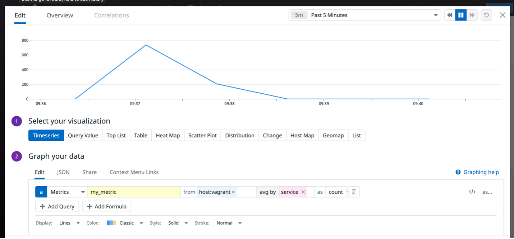
-	Any metric from the Integration on your Database with the anomaly function applied
-    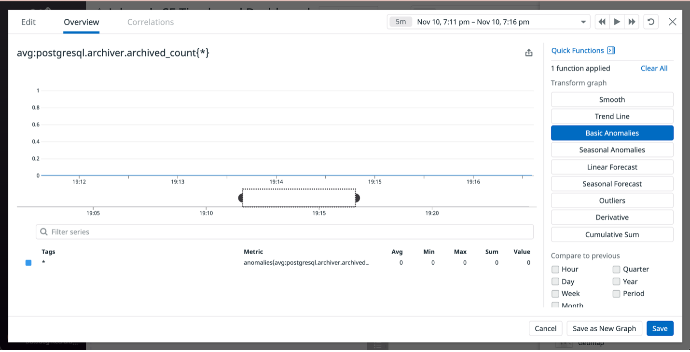
-	Your customer metric with the rollup function applied to sum up all the points for the past hour into one bucket
-    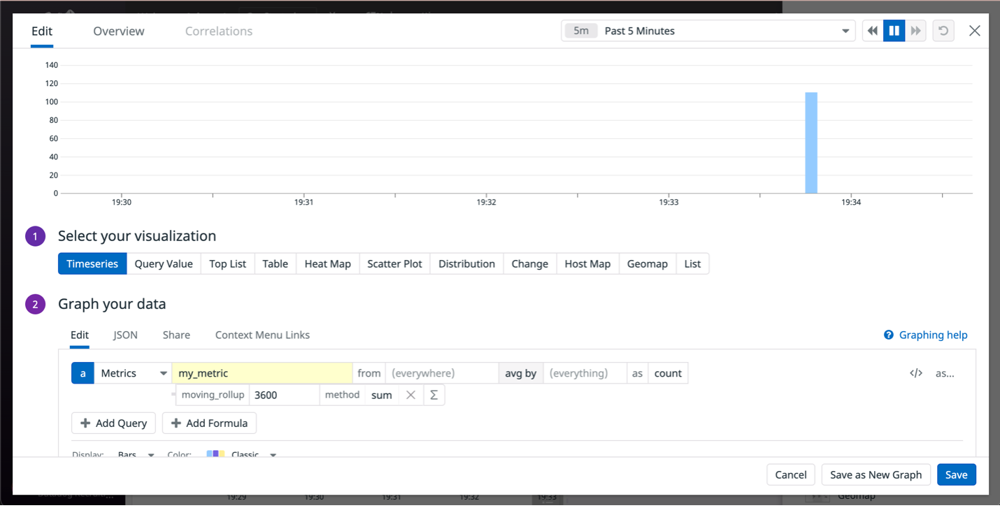
 
Once this is created, access the dashboard from your Dashboard List in the UI:
-	Set the Timeboard’s timeframe to the past 5 minutes 
-    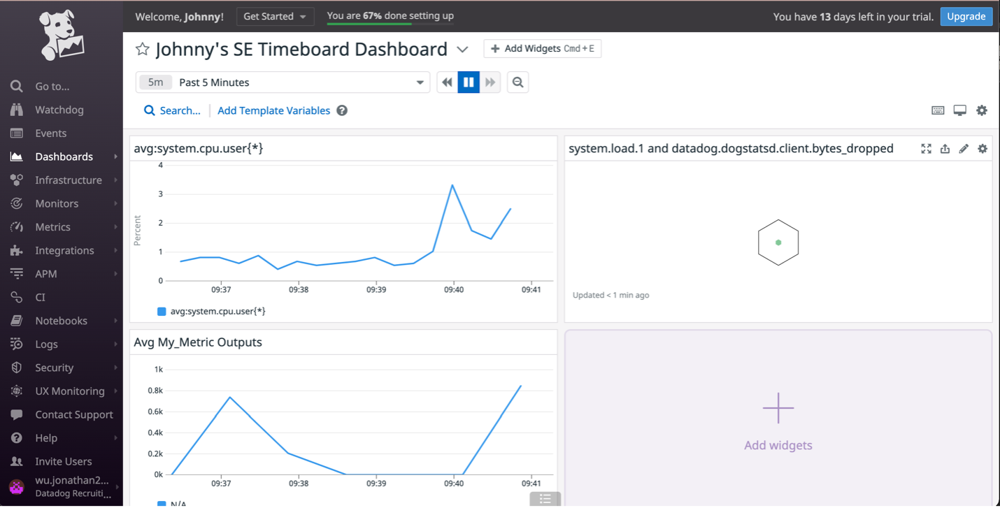

-	Take a snapshot of this graph and use the @ notation to send it to yourself
-    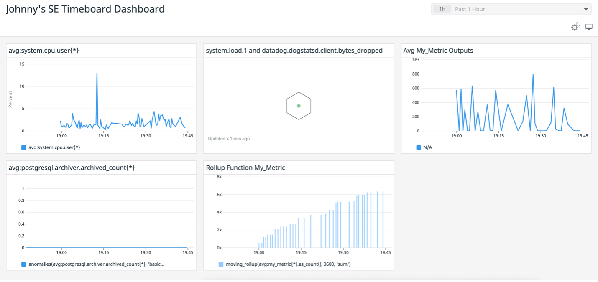

BONUS QUESTION: What is the Anomaly graph display?
ANSWER: The Anomaly graph displays two views the historical view and evaluation preview. The historical view allows the user to monitor the metric at different time scales to better understand why data may be considered anomalous or non-anomalous. The evaluation preview is longer than the alerting window and helps provide information about what the anomalies algorithm takes into account when predicting the bounds. The anomaly function uses the past data to predict what is expected in the future.

MONITORING DATA:
Create a new Metric Monitor that watches the average of your custom metric (my_metric) and will alert if it’s above the following values over the past 5 minutes:
-	Warning threshold of 500
-	Altering threshold of 800
-	And also ensure that it will notify you if there is No Data for this query over the past 10m
Please configure the monitor’s message so that it will: 
-	Send you an email whenever the monitor triggers.
-	Create different messages based on whether the monitor is in an Alert, Warning, or No Data State
-	Include the metric value that caused the monitor to trigger and host IP when the Monitor triggers an Alert state
-	When this monitor sends you and email notification, take a screenshot of the email that it sends you

Bonus Question: Since this monitor is going to alert pretty often, you don’t want to be alerted when you are out of the office. Set up two scheduled downtimes for this monitor:
-    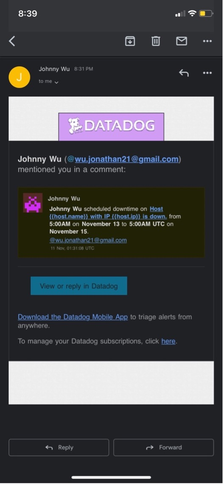  
-    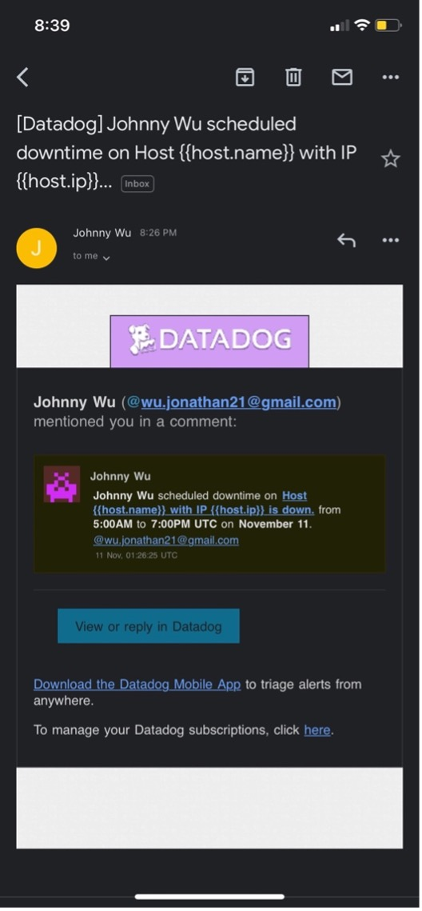
-    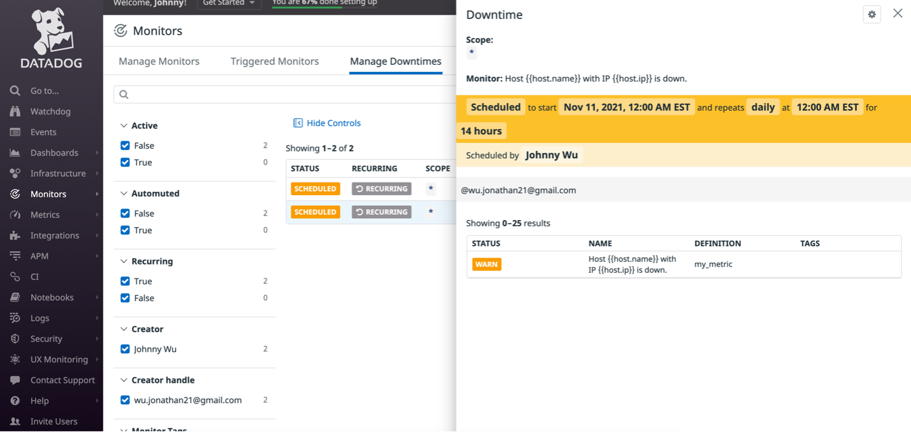
-    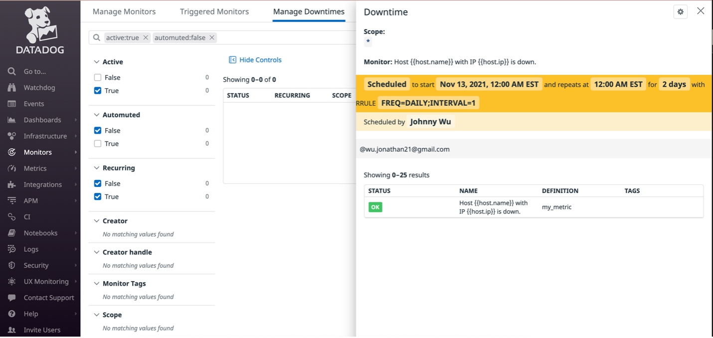 
 
COLLECTING APM DATA:
Please include your fully instrumented app in your submission, as well: https://app.datadoghq.com/dashboard/hbb-xrj-zzj/johnnys-se-timeboard-dashboard?from_ts=1636843557909&to_ts=1636857957909&live=true 
 
-    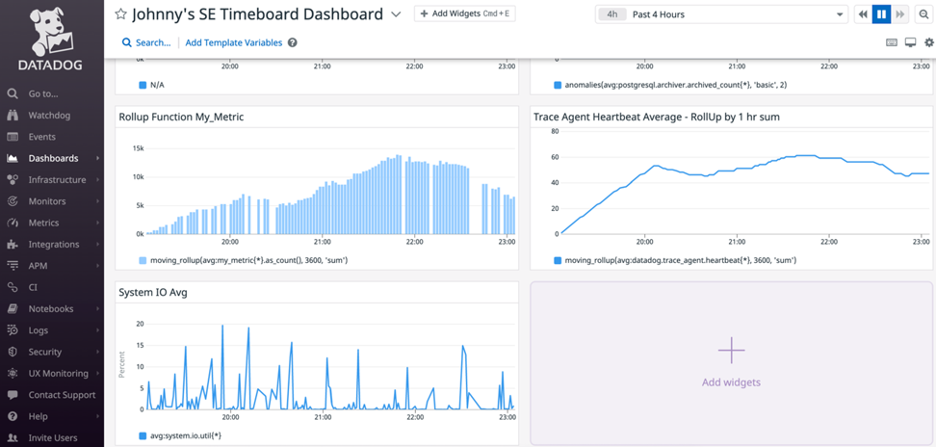
-    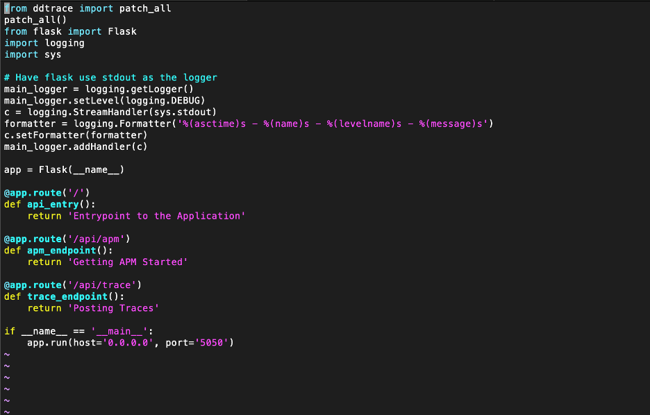
BONUS QUESTION: What is the difference between a Service and Resource?
ANSWER: A Service can be a self-contained, independently developed, deployed, managed, and maintained software implementation supporting specific business-relevant functionality for companies. It is not a programming contrast or a set of APIs, but rather an architectural and deployment artifact used for implementation of enterprise solutions. A Resource on the other hand is a directly accessible, independently developed, deployed, managed and maintained software artifact supporting specific data. 

FINAL QUESTION:
Datadog has been used in a lot of creative ways in the past. We’ve written some blog posts about using Datadog to monitor the NYC subway System, Pokemon Go, and even office restroom availability!
Is there anything creative you would use Datadog for?

 
Datadog allows for an effective and flexible monitoring system of a client’s entire infrastructure. There are several ways where Datadog can be leveraged to monitor everything, such as utilizing Agent Check to collect metrics from any data sources and running HTTP checks to verify if a website is up or down. With this, I believe Datadog can be extremely effective in three different industries.
 
Retail/Grocery Market:
The opportunities for utilizing Datadog to help track metrics are endless in the retail industry. Many grocery markets are facing trouble keeping certain items in stock, especially when the pandemic has disrupted the supply chain. Markets can connect their internal warehouse and vendor data to Datadog, along with their current inventory movement data to help understand when the best time is to repurchase items in real-time. There are also opportunities where grocery markets and retail stores that have self-service machines for checkout, can utilize Datadog dashboards to help understand which check-out machines require maintenance. With that information, they can properly inform their customers of the approximate wait time for an available machine and direct any congestions to other registers attended by a representative. 
 
Healthcare:
Having real-time knowledge of what PPE and medical instruments are in use or available is very important. Datadog can be utilized in tracking what instruments are in use in different hospital rooms, and when they are currently idle but are left in patient rooms unused. Additionally, Datadog dashboards can track the average patient time/performance time of medical professionals. This means when doctors or nurses are requested, patients can be given a more accurate estimate time of when they will be seen by a professional. The healthcare industry is also gravitating towards mobile devices, so tracking security and being HIPAA compliant is very important. To avoid large violation fees, hospital IT teams can track and view when security procedures are no longer up to date on devices and see what information could be compromised.  
 
Food Delivery Services:
The food delivery services have peaked during the pandemic. Area managers of food delivery service providers can track and report on their drivers’ performance time when reaching the restaurant, waiting, and finally delivering the takeout to the consumers. With this information, they can coach their drivers and identify areas where they can improve on. Area managers can also use this information to help reorganize and notify the drivers to delay going to certain restaurants if the restaurant has previously missed their average order completion time.
 
Datadog is truly an effective and adaptable resource that every industry can leverage to help them identify their areas of weaknesses as well as create new metrics to help track and improve productivity and performance. 
 
 
Thank you so much for this assignment! I look forward to utilizing my skills to help be an asset to the team!
 
All the best,
Johnny Wu

