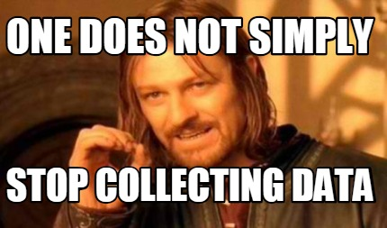

Answers below or refer to FINALSUBMISSION-JohnnyWu.pdf


ABSTRACT:
Dear readers,
 
Thank you so much for a wonderful opportunity to practice creating meaningful dashboard metrics that would help clients observe their systems better. I look forward to expanding my implementation knowledge and leveraging my previous technical and communication skills to help clients enhance the Datadog dashboard features.
 
Below is a documentation of my thoughts and processes of completing each of the challenges. The intention of the documentation is to have it be a walkthrough process to help a client understand and achieve similar results. The documentation will include code and pictures of the code and dashboard associated with the code highlighted in grey. I hope you enjoy my work and have fun!
 
Best,
Johnny
PREREQUISITES – SETUP THE ENVIRONMENT:
First, we need to set up an environment to configure the Datadog Agent. There are two ways to set up an environment. You can choose to set up a containerized approach with Docker for Linux or you could set up a Vagrant Unbuntu VM. I chose to set up a Vagrant Unbuntu VM because I previously have had experience creating VMs and setting up VM permissions from my experience as a Technology Consultant. 
 
Using the information pages below, this is how I set up my environment and configured the Datadog Agent. 
 
To quickly understand how to install Vagrant, this link provides information before setting up the environment: 
https://learn.hashicorp.com/tutorials/vagrant/getting-started-index?in=vagrant/getting-started
 
I first downloaded the necessary 
Installing the Vagrant: https://www.vagrantup.com/docs/installation
Installing the Vagrant Box: https://www.virtualbox.org/
 
Once the installations are completed, pull up the terminal and paste the following commands to run your VM:
Once the download is done, to verify the installation:
```
$ vagrant
```
Once the verification is successful, it is time to bring up the Vagrant:
```
$ vagrant up
```
You can now boot up the SSH into the machine:
```
$ vagrant ssh
``` 
 
Once these steps are done, it is now time to install and configure the Datadog Agent. Using the Datadog information link: https://docs.datadoghq.com/agent/
- Select the “Unbutu” directions. It should bring you to the following link https://docs.datadoghq.com/agent/basic_agent_usage/ubuntu/?tab=agentv6v7. 
- On the webpage, copy and paste the following command lines into the terminal to install the agent:

- DESCRIPTION:
- Start Agent as a service	
- Command:
```
sudo service datadog-agent start
```
DESCRIPTION:
- Run a check
- COMMAND:
```	
sudo -u dd-agent -- datadog-agent check <CHECK_NAME>
```
After these steps, the environment and the Datadog Agent are now complete!


COLLECTING METRICS:


- Datadog is great at collecting data for monitoring a company’s metrics. One task we can start off with is to use the Agent to configure a tag and monitor it using a Host Map on the Datadog dashboard. 

Directions to add a tag:
To add tags in the Agent config file, go back to your terminal and paste the following code
- DESCRIPTION: 
- This command will allow you to go into the datadog.yaml config file and alter some of the code
- COMMAND:
```
vagrant@vagrant:~$ sudo nano datadog.yaml
```

From there, scroll down to where you see “tag”, remove the “##” marks and add a tag name (the tag name can be whatever you’d like to name it!): 
- CODE:
```
Tags:
-	“environment : dev”
```
-	 
- Once you have completed adding a tag, it is time to restart the agent and refresh the Datadog Dashboard.
- DESCRIPTION:
- This will restart the agent.
- COMMAND:
```
vagrant@vagrant:~$ sudo service datadog-agent restart
```

- DESCRIPTION:
- If the metric still does not show on the dashboard after the restart and a refresh of the dashboard, try this step. This command will stop the agent. 	
- COMMAND:
```
vagrant@vagrant:~$ sudo service datadog-agent stop
```

- DESCRIPTION:
- After stopping the agent, you must start the agent again. These stop/start commands is an alternative way of restarting the agent. 	
- COMMAND:
```
vagrant@vagrant:~$ sudo service datadog-agent start
```

Once the agent restart has been completed, go back to the web browser and refresh the dashboard. Select a host map and select the tag as your metric as shown below.

-    

- Another feature in Datadog that we can utilize is creating a custom agent. We first need to install a database. I chose PostgreSQL, but any database will work.
I referenced this website: https://ubuntu.com/server/docs/databases-postgresql


- DESCRIPTION:
- Installs the database and set a password for the postgres user
- COMMAND:
```
vagrant@vagrant:~$ sudo apt install postgresql
vagrant@vagrant:~$ sudo -u postgres psql template1
```

- DESCRIPTION:
- Implementing the Datadog Agent	
- COMMAND:
```
vagrant@vagrant:/etc/postgresql/10$ sudo vim /etc/datadog-agent/datadog.yaml^C
vagrant@vagrant:/etc/postgresql/10$ cd /etc/datadog-agent
```

Once the setup is complete, we can now create the custom agent! Referencing this Datadog link of how to create a custom agent (https://docs.datadoghq.com/developers/write_agent_check/?tab=agentv6v7), I used the following code:
```
vagrant@vagrant:/etc/datadog-agent$ cd checks.d
vagrant@vagrant:/etc/datadog-agent/checks.d$ ls
vagrant@vagrant:/etc/datadog-agent/checks.d$ sudo vim hello.py
```
Once I created a custom agent and called it “hello.py”, I want to create the agent check that submits a metric with a random value between 0 and 1000
-    
-	CODE: 
```

# the following try/except block will make the custom check compatible with any Agent version
import random
try:
    # first, try to import the base class from new versions of the Agent...
    from datadog_checks.base import AgentCheck
except ImportError:
    # ...if the above failed, the check is running in Agent version < 6.6.0
    from checks import AgentCheck

# content of the special variable __version__ will be shown in the Agent status page
__version__ = "1.0.0"

class HelloCheck(AgentCheck):
    def check(self, instance):
        self.monotonic_count('my_metric', random.randint(0,1000))
```
- We would also like to change the .py so that it only submits the metric once every 45 seconds. To do so use this line of command and change the default value (30) to 45.
- Code:
```
vagrant@vagrant:/etc/datadog-agent/conf.d$ sudo vim hello.yaml
```


- CODE:
```
init_config:

instances:
  - min_collection_interval: 45
```
Once all the creation and configuration is complete, check the .py with this command:
```
vagrant@vagrant:/etc/datadog-agent/checks.d$ sudo -u dd-agent -- datadog-agent check hello
```

BONUS QUESTION: Can you change the collection interval without modifying the Python check file you created?
ANSWER: yes, you can change the collection interval without modifying the Python check file created. 


VISUALIZING DATA:
Utilize the Datadog API to create a Time board that contains:
*Your custom metric scoped over your host*
-    
- Selecting “my_metric” we created previously, I decided to use a time-series graph. I used this type of graph because I wanted to see what the metric was producing for the randomly generated numbers. I also thought of using a histogram, but I was curious if the code would generate more “0” or “less than 500” in a timeframe than other numbers. Additionally, since it was just created recently, it made the most sense to use a time-series graph.


*Any metric from the Integration on your Database with the anomaly function applied*
-    
- For this metric as well, using any metric from my database with the anomaly function applied, I used a time-series table. Since the VM was closed every time I logged off, it would be good to use the time-series chart to see when there were issues within the small time frame when the VM is turned on, other graphs that summarized the data did not show helpful information.


*Your customer metric with the rollup function applied to sum up all the points for the past hour into one bucket* 
-    
- Using the roll-up function, to sum up, all points for my my_metric function, the time-series graph was a good choice to use. It provides a helpful insight of at which time, what was the total of all of my randomly generated numbers. 


Once this is created, access the dashboard from your Dashboard List in the UI:
-	Set the Timeboard’s timeframe to the past 5 minutes 
-    


-	Take a snapshot of this graph and use the @ notation to send it to yourself
-    

- BONUS QUESTION: What is the Anomaly graph display?
ANSWER: The Anomaly graph displays two views the historical view and the evaluation preview. The historical view allows the user to monitor the metric at different time scales to better understand why data may be considered anomalous or non-anomalous. The evaluation preview is longer than the alerting window and helps provide information about what the anomalies algorithm takes into account when predicting the bounds. The anomaly function uses the past data to predict what is expected in the future.


MONITORING DATA:
Another great feature Datadog has is having an easy way to monitor the data. Here we will create a new Metric Monitor that watches the average of our custom metric (my_metric) and will alert if it’s above the following values over the past 5 minutes:
-	Warning threshold of 500
-	Altering threshold of 800
-	And also ensure that it will notify you if there is No Data for this query over the past 10m
Please configure the monitor’s message so that it will: 
-	Send you an email whenever the monitor triggers.
-	Create different messages based on whether the monitor is in an Alert, Warning, or No Data State
-	Include the metric value that caused the monitor to trigger and host IP when the Monitor triggers an Alert state
-	When this monitor sends you and email notification, take a screenshot of the email that it sends you

To complete these monitoring systems, I used this link and followed the steps: https://docs.datadoghq.com/monitors/

Bonus Question: Since this monitor is going to alert pretty often, you don’t want to be alerted when you are out of the office. Set up two scheduled downtimes for this monitor:

-      
-    
-    
-     
 
- COLLECTING APM DATA:
We are provided a Flask App. 
- Let us save the code into a .py called “testapp”
```
vagrant@vagrant:~$ mkdir test_flask_app
vagrant@vagrant:~$ cd test_flask_app
vagrant@vagrant:~/test_flask_app$ vim testapp
vagrant@vagrant:~/test_flask_app$ mv testapp testapp.py
```
-    

- Code:
```
from ddtrace import patch_all
patch_all()
from flask import Flask
import logging
import sys

# Have flask use stdout as the logger
main_logger = logging.getLogger()
main_logger.setLevel(logging.DEBUG)
c = logging.StreamHandler(sys.stdout)
formatter = logging.Formatter('%(asctime)s - %(name)s - %(levelname)s - %(message)s')
c.setFormatter(formatter)
main_logger.addHandler(c)

app = Flask(__name__)

@app.route('/')
def api_entry():
    return 'Entrypoint to the Application'

@app.route('/api/apm')
def apm_endpoint():
    return 'Getting APM Started'

@app.route('/api/trace')
def trace_endpoint():
    return 'Posting Traces'

if __name__ == '__main__':
    app.run(host='0.0.0.0', port='5050')
~ 
```
To run this code, we will need to install flask and ddtrace:
```
Vagrant@vagrant:~/test_flask_app$ pip3 install flask
vagrant@vagrant:~/test_flask_app$ pip3 install ddtrace 
```
 This is my link to the Dashboard along with a screenshot: https://app.datadoghq.com/dashboard/hbb-xrj-zzj/johnnys-se-timeboard-dashboard?from_ts=1636843557909&to_ts=1636857957909&live=true 

-    
- Once the setup for the flask app is complete, I went back to the dashboard and created a time-series graph of I/O warnings. When looking at I/O averages, it is good to see when these errors are occurring so we can see if it is impacting major business usage. Additionally, creating warnings when there are high I/O warnings is necessary as it indicates there is a bottleneck where the system does not have fast enough input/output performance. 


BONUS QUESTION: What is the difference between a Service and a Resource?
ANSWER: A Service can be a self-contained, independently developed, deployed, managed, and maintained software implementation supporting specific business-relevant functionality for companies. It is not a programming contrast or a set of APIs, but rather an architectural and deployment artifact used for the implementation of enterprise solutions. A Resource on the other hand is a directly accessible, independently developed, deployed, managed, and maintained software artifact supporting specific data.


FINAL QUESTION:

-    

- Datadog allows for an effective and flexible monitoring system of a client’s entire infrastructure (it was used to help monitor Pokemon Go!). There are several ways where Datadog can be leveraged to monitor everything, such as utilizing Agent Check to collect metrics from any data sources and running HTTP checks to verify if a website is up or down. With this, I believe Datadog can be extremely effective in three different industries.
 
Retail/Grocery Market:
The opportunities for utilizing Datadog to help track metrics are endless in the retail industry. Many grocery markets are facing trouble keeping certain items in stock, especially when the pandemic has disrupted the supply chain. Markets can connect their internal warehouse and vendor data to Datadog, along with their current inventory movement data to help understand when the best time is to repurchase items in real-time. There are also opportunities where grocery markets and retail stores that have self-service machines for checkout, can utilize Datadog dashboards to help understand which check-out machines require maintenance. With that information, they can properly inform their customers of the approximate wait time for an available machine and direct any congestions to other registers attended by a representative. 

-    
 
- Healthcare:
Having real-time knowledge of what PPE and medical instruments are in use or available is very important. Datadog can be utilized in tracking what instruments are in use in different hospital rooms, and when they are currently idle but are left in patient rooms unused. Additionally, Datadog dashboards can track the average patient time/performance time of medical professionals. This means when doctors or nurses are requested, patients can be given a more accurate estimate time of when they will be seen by a professional. The healthcare industry is also gravitating towards mobile devices, so tracking security and being HIPAA compliant is very important. To avoid large violation fees, hospital IT teams can track and view when security procedures are no longer up to date on devices and see what information could be compromised.  
 
Food Delivery Services:
The food delivery services have peaked during the pandemic. Area managers of food delivery service providers can track and report on their drivers’ performance time when reaching the restaurant, waiting, and finally delivering the takeout to the consumers. With this information, they can coach their drivers and identify areas where they can improve on. Area managers can also use this information to help reorganize and notify the drivers to delay going to certain restaurants if the restaurant has previously missed their average order completion time.

-    

- Datadog is truly an effective and adaptable resource that every industry can leverage to help them identify their areas of weaknesses as well as create new metrics to help track and improve productivity and performance. 
 
 
Thank you so much for this assignment! I look forward to utilizing my skills to help be an asset to the team!
 
All the best,
Johnny Wu
